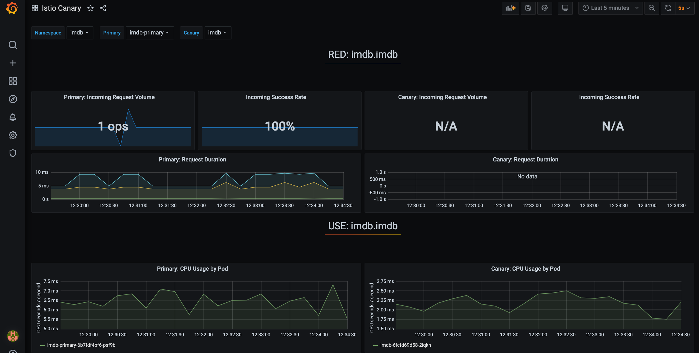

# Automated Canary deployment using Flagger

[Flagger](https://flagger.app/) is a progressive delivery tool that automates the release process for applications running on Kubernetestakes a Kubernetes deployment. It creates a series of objects (Kubernetes deployments, ClusterIP services, Istio destination rules and virtual services) for an application. These objects expose the application inside the mesh and drive the canary analysis and promotion.

## Install Flagger

```bash

cd apps/flagger

# check deploy targets (should be [])
flt targets list

# clear the targets if not []
flt targets clear

# add all clusters as a target
flt targets add all

# deploy the changes
flt targets deploy

```

### Check that your GitHub Action is running

- <https://github.com/yourOrg/yourRepo/actions>
  - your action should be queued or in-progress

### Check deployment

- Once the action completes successfully

```bash

# you should see flagger added to your cluster
git pull

# force flux to sync
# flux will sync on a schedule - this command forces it to sync now for debugging
flt sync

# check that flagger is deployed to your cluster
flt check app flagger
flt check app prometheus

```

We also deploy prometheus to scrape metrics to monitor Canary deployment.

## Update reference app to use Canary deployment Strategy

- To upate IMDb reference app to use canary deployment template:
  - Update `app.yaml` with template value </br>
      `template: pib-service-canary`
  - Run `flt targets deploy` to deploy the changes

Once the github action is completed and flux sync is performed, the reference app should be updated with Canary Deployment objects listed:

> NOTE: We deploy `webv` to generate traffic to the reference app for the canary analysis and rollbacks

  ```bash

      deployment.apps/imdb
      deployment.apps/imdb-primary
      deployment.apps/webv-imdb
      service/imdb
      service/imdb-canary
      service/imdb-primary
      service/webv-imdb
      destinationrule.networking.istio.io/imdb-canary
      destinationrule.networking.istio.io/imdb-primary
      virtualservice.networking.istio.io/imdb

  ```

## Monitoring Canary deployments using Grafana

Flagger comes with a Grafana dashboard made for canary analysis. Install Grafana

  ```bash

  cd apps/flagger-grafana

  # check deploy targets (should be [])
  flt targets list

  # clear the targets if not []
  flt targets clear

  # add all clusters as a target
  flt targets add all

  # deploy the changes
  flt targets deploy

  ```

Navigate to grafana dashboard by appending `yourHostUrl/grafana` with login info
- admin
- change-me



